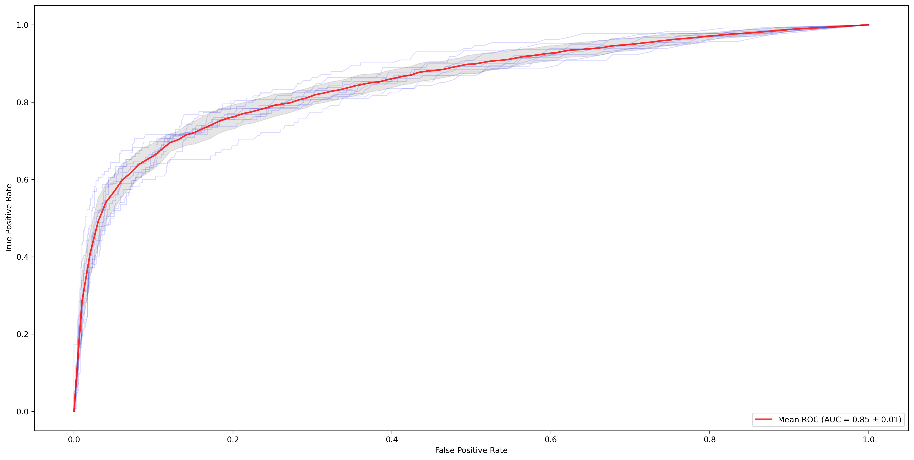

===============
CoPro
===============

Welcome to CoPro, a machine-learning tool for conflict risk projections based on climate, environmental, and societal drivers.

.. image:: https://travis-ci.com/JannisHoch/copro.svg?branch=dev
    :target: https://travis-ci.com/JannisHoch/copro

.. image:: https://img.shields.io/badge/License-MIT-blue.svg
    :target: https://github.com/JannisHoch/copro/blob/dev/LICENSE

.. image:: https://readthedocs.org/projects/copro/badge/?version=latest
    :target: https://copro.readthedocs.io/en/latest/?badge=latest

.. image:: https://img.shields.io/github/v/release/JannisHoch/copro
    :target: https://github.com/JannisHoch/copro/releases/tag/v0.0.8

.. image:: https://zenodo.org/badge/254407279.svg
    :target: https://zenodo.org/badge/latestdoi/254407279

.. image:: https://badges.frapsoft.com/os/v2/open-source.svg?v=103
    :target: https://github.com/ellerbrock/open-source-badges/

.. image:: https://joss.theoj.org/papers/1f03334e56413ff71f65092ecc609aa4/status.svg
    :target: https://joss.theoj.org/papers/1f03334e56413ff71f65092ecc609aa4

.. image:: https://mybinder.org/badge_logo.svg
    :target: https://mybinder.org/v2/gh/JannisHoch/copro/dev?filepath=%2Fexample%2Fnb_binder.ipynb

Model purpose
--------------

As primary model output, CoPro provides maps of conflict risk.

To that end, it employs observed conflicts as target data together with (user-provided) socio-economic and environmental sample data to train different classifiers (RFClassifier, kNearestClassifier, and Support Vector Classifier).
While the samples have the units of the data, the target value is converted to Boolean, where a 0 indicates no conflict occurrence and 1 indicates occurrence.
To capture the geographical variability of conflict and socio-environmental drivers, the model is spatially explicit and calculates conflict risk at a (user-specified) aggregation level.
This way, the model can also capture the relevant sub-national variability of conflict and conflict drivers.
Model robustness is determined using a split-sample test where a part of the data is used to train the model, while the other part is used to evaluate the outcome. 
Throughout this process, the geographical unit is tracked to be able to map the resulting conflict risk to the correct areas.

In addition to the calculation of conflict risk, can the model, for instance, be used to make scenario projections, evaluate the relative feature importances, or benchmark different datasets.

All in all, CoPro supports the mapping of current and future areas at risk of conflict, while also facilitating obtaining a better understanding of the underlying processes.

Installation
----------------

To install copro, first clone the code from GitHub. It is advised to create an individual python environment first. 
You can then install the model package into this environment.

To do so, you need to have Anaconda or Miniconda installed. For installation guidelines, see `here <https://docs.anaconda.com/anaconda/install/>`_.

.. code-block:: console

    $ git clone https://github.com/JannisHoch/copro.git
    $ cd path/to/copro
    $ conda env create -f environment.yml
    $ conda activate copro

To install CoPro in editable mode in this environment, run this command next in the CoPro-folder:

.. code-block:: console

    $ pip install -e .

When using Jupyter Notebook, it can be handy to have the copro environment available. It can be installed into Jupyter Notebook with the following command:

.. code-block:: console

    $ python -m ipykernel install --name=copro

Command-line script
--------------------

To be able to run the model, the conda environment has to be activated first.

.. code-block:: console

    $ conda activate copro

To run the model from command line, a command line script is provided. The usage of the script is as follows:

.. code-block:: console

    Usage: copro_runner [OPTIONS] CFG

    Main command line script to execute the model. 
    All settings are read from cfg-file.
    One cfg-file is required argument to train, test, and evaluate the model.
    Multiple classifiers are trained based on different train-test data combinations.
    Additional cfg-files for multiple projections can be provided as optional arguments, whereby each file corresponds to one projection to be made.
    Per projection, each classifiers is used to create separate projection outcomes per time step (year).
    All outcomes are combined after each time step to obtain the common projection outcome.

    Args:     CFG (str): (relative) path to cfg-file

    Options:
    -plt, --make_plots        add additional output plots
    -v, --verbose             command line switch to turn on verbose mode

This help information can be also accessed with

.. code-block:: console

    $ copro_runner --help

All data and settings are retrieved from the settings-file (cfg-file) which needs to be provided as inline argument.

In case issues occur, updating ``setuptools`` may be required.

.. code-block:: console

    $ pip3 install --upgrade pip setuptools

Example data
----------------

Example data for demonstration purposes can be downloaded from `Zenodo <https://zenodo.org/record/4297295>`_.
To facilitate this process, the bash-script ``download_example_data.sh`` can be called in the example folder under `/_scripts`.

With this (or other) data, the provided configuration-files (cfg-files) can be used to perform a reference run or a projection run. 
All output is stored in the output directory specified in the cfg-files. 
In the output directory, two folders are created: one name `_REF` for output from the reference run, and `_PROJ` for output for projections.

Jupyter notebooks
^^^^^^^^^^^^^^^^^^

There are multiple jupyter notebooks available to guide you through the model application process step-by-step.

It is possible to execute the notebooks cell-by-cell and explore the full range of possibilities.
Note that in this case the notebooks need to be run in the right order as some temporary files will be saved to file in one notebook and loaded in another!
This is due to the re-initalization of the model at the beginning of each notebook and resulting deletion of all files in existing output folders.

The notebooks are also used to exemplify the `Workflow <https://copro.readthedocs.io/en/latest/examples/index.html>`_ of CoPro.

Command-line
^^^^^^^^^^^^^^^^^^

While the notebooks are great for exploring, the command line script is the envisaged way to use CoPro.

To only test the model for the reference situation and one projection, the cfg-file for the reference run is the required argument.
This cfg-file needs to point to the cfg-file of the projection in turn.

.. code-block:: console

    $ cd path/to/copro/example
    $ copro_runner example_settings.cfg

Alternatively, the same commands can be executed using a bash-file.

.. code-block:: console

    $ cd path/to/copro/example/_scripts
    $ sh run_command_line_script.sh

Validation
^^^^^^^^^^^^^^^^^^

The reference model makes use of the `UCDP Georeferenced Event Dataset <https://ucdp.uu.se/downloads/index.html#ged_global>`_ for observed conflict. 
The selected classifier is trained and validated against this data.

Main validation metrics are the ROC-AUC score as well as accuracy, precision, and recall. 
All metrics are reported and written to file per model evaluation.

With the example data downloadable from `Zenodo <https://zenodo.org/record/4297295>`_, a ROC-AUC score of above 0.8 can be obtained. 
Note that with additional and more explanatory sample data, the score will most likely increase.

Additional ways to validate the model are showcased in the `Workflow <https://copro.readthedocs.io/en/latest/examples/index.html>`_.

Documentation
---------------

Extensive model documentation including full model API description can be found at http://copro.rtfd.io/

Code of conduct and Contributing
---------------------------------

The project welcomes contributions from everyone! 
To make collaborations as pleasant as possible, we expect contributors to the project to abide by the Code of Conduct.

License
--------

CoPro is released under the MIT license.

Authors
----------------

* Jannis M. Hoch (Utrecht University)
* Sophie de Bruin (Utrecht University, PBL)
* Niko Wanders (Utrecht University)

Corresponding author: Jannis M. Hoch (j.m.hoch@uu.nl)
